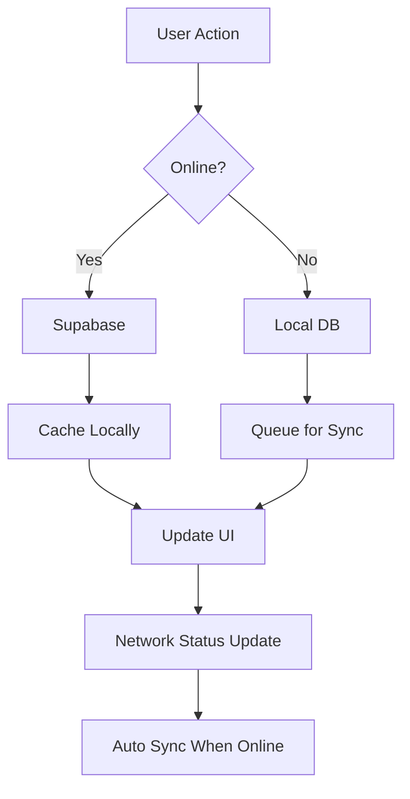

# Hybrid Database System

This project implements a sophisticated hybrid database system that seamlessly switches between online (Supabase) and offline (IndexedDB) storage based on network connectivity and user preferences.

## Features

### 🔄 Automatic Network Detection
- **Real-time connectivity monitoring**: Continuously checks internet connection status
- **Browser events**: Listens to `online`/`offline` events
- **Active polling**: Performs periodic connectivity checks every 30 seconds
- **Supabase health checks**: Tests actual database connectivity, not just network status

### 📱 Three Operation Modes

#### 1. **Online Mode** (`online`)
- Uses Supabase as primary data source
- Falls back to local database if Supabase is unavailable
- Real-time synchronization with cloud database
- Best for stable internet connections

#### 2. **Offline Mode** (`offline`)
- Uses only local IndexedDB storage
- No network requests made
- Perfect for areas with poor connectivity
- All changes are queued for later sync

#### 3. **Hybrid Mode** (`hybrid`) - **Recommended**
- Automatically switches between online/offline based on connectivity
- Maintains local cache for offline access
- Queues changes when offline, syncs when online
- Best of both worlds

### 🔄 Intelligent Synchronization

#### **Sync Queue System**
- All offline changes are queued in IndexedDB
- Automatic processing when connection is restored
- Retry mechanism for failed sync operations
- Conflict resolution based on timestamps

#### **Bidirectional Sync**
- **Push**: Local changes → Supabase
- **Pull**: Supabase changes → Local
- **Conflict Resolution**: Uses `lastSynced` timestamps
- **Incremental Updates**: Only syncs changed records

#### **Automatic Sync Triggers**
- When coming back online
- Every 5 minutes (configurable)
- When switching modes
- Manual sync available

### 📊 Data Tables Supported

#### **Events**
- Full CRUD operations
- Company-specific filtering
- QR code generation
- Custom backgrounds and logos

#### **Attendees**
- Registration and check-in
- Table assignments
- Company information
- Contact details

#### **Lucky Draw Winners**
- Winner tracking
- Prize management
- Table-based draws
- Session management

### 🎯 Smart Fallback Strategy

```typescript
// Priority order for data retrieval:
1. Online mode + Supabase available → Supabase
2. Online mode + Supabase unavailable → Local fallback
3. Hybrid mode + Online → Supabase + Local cache
4. Hybrid mode + Offline → Local only
5. Offline mode → Local only
```

## Usage

### Basic Setup

```typescript
import { useHybridDB } from './lib/hybridDB';

function MyComponent() {
  const { 
    getEvents, 
    createEvent, 
    syncAllData, 
    isOnline 
  } = useHybridDB();

  // Data operations work seamlessly regardless of connectivity
  const handleCreateEvent = async () => {
    const event = await createEvent({
      name: 'My Event',
      company_id: 'company-123',
      date: '2024-01-15'
    });
    // Automatically synced when online
  };
}
```

### Network Status Monitoring

```typescript
import { useSyncStatusStore } from './lib/hybridDB';

function StatusComponent() {
  const { status, isOnline, pendingChanges } = useSyncStatusStore();
  
  return (
    <div>
      Status: {status} | Online: {isOnline ? 'Yes' : 'No'}
      Pending: {pendingChanges}
    </div>
  );
}
```

### Mode Management

```typescript
import { useGlobalModeStore } from './lib/globalModeStore';

function ModeSelector() {
  const { mode, setMode } = useGlobalModeStore();
  
  return (
    <select value={mode} onChange={(e) => setMode(e.target.value)}>
      <option value="online">Online</option>
      <option value="offline">Offline</option>
      <option value="hybrid">Hybrid</option>
    </select>
  );
}
```

## Architecture

### Core Components

#### **NetworkManager** (Singleton)
- Monitors internet connectivity
- Manages online/offline state
- Notifies listeners of status changes
- Performs health checks

#### **SyncQueue**
- Queues offline operations
- Processes queue when online
- Handles retry logic
- Tracks pending changes

#### **HybridDB** (Dexie)
- Local IndexedDB storage
- Schema management
- Data versioning
- Sync status tracking

#### **useHybridDB Hook**
- Unified data access layer
- Automatic mode switching
- Seamless fallback handling
- CRUD operations

### Data Flow



## Configuration

### Environment Variables
```env
VITE_SUPABASE_URL=your-supabase-url
VITE_SUPABASE_ANON_KEY=your-anon-key
```

### Database Schema
```typescript
// Events table
interface Event {
  id: string;
  company_id: string;
  name: string;
  description?: string;
  date?: string;
  location?: string;
  max_attendees?: number;
  registration_qr?: string;
  offline_qr?: string;
  created_at?: string;
  mode?: 'offline' | 'online' | 'hybrid';
  lastSynced?: string;
  syncStatus?: 'pending' | 'synced' | 'error';
  isLocal?: boolean;
}
```

## Best Practices

### 1. **Always Use Hybrid Mode**
- Provides best user experience
- Handles connectivity issues gracefully
- Maintains data consistency

### 2. **Handle Sync Status**
- Show sync indicators to users
- Display pending changes count
- Provide manual sync options

### 3. **Error Handling**
- Graceful degradation when offline
- Clear error messages
- Retry mechanisms

### 4. **Performance**
- Local caching for fast access
- Incremental syncs
- Background sync operations

## Troubleshooting

### Common Issues

#### **Data Not Syncing**
1. Check network connectivity
2. Verify Supabase configuration
3. Check browser console for errors
4. Try manual sync

#### **Offline Mode Not Working**
1. Verify IndexedDB is available
2. Check browser storage permissions
3. Clear browser cache if needed

#### **Sync Conflicts**
1. Check `lastSynced` timestamps
2. Review conflict resolution logic
3. Manual intervention may be needed

### Debug Tools

```typescript
// Check sync status
const { status, pendingChanges } = useSyncStatusStore();

// Check network status
const { isOnline } = useSyncStatusStore();

// Manual sync
const { syncAllData } = useHybridDB();

// View local data
const localEvents = await hybridDB.events.toArray();
```

## Migration Guide

### From Online-Only to Hybrid

1. **Install Dependencies**
```bash
npm install dexie
```

2. **Update Data Access**
```typescript
// Before
const { data } = await supabase.from('events').select('*');

// After
const events = await getEvents();
```

3. **Add Sync Status UI**
```typescript
// Network status is now handled internally
// No additional UI components needed
```

4. **Initialize Hybrid System**
```typescript
import { useHybridInit } from './lib/useHybridInit';

function App() {
  useHybridInit();
  // ... rest of app
}
```

## Performance Considerations

### **Storage Limits**
- IndexedDB: ~50MB (varies by browser)
- Supabase: Based on plan limits
- Monitor storage usage

### **Sync Frequency**
- Default: Every 5 minutes
- Configurable based on needs
- Consider battery life on mobile

### **Data Size**
- Compress large data
- Use pagination for large datasets
- Implement data cleanup

## Security

### **Data Protection**
- Local data encrypted (browser-dependent)
- Supabase RLS policies apply
- No sensitive data in sync queue

### **Access Control**
- User authentication required
- Company-specific data isolation
- Role-based permissions

## Future Enhancements

### **Planned Features**
- [ ] Real-time sync with WebSockets
- [ ] Advanced conflict resolution
- [ ] Data compression
- [ ] Offline-first PWA support
- [ ] Multi-device sync
- [ ] Backup and restore

### **Performance Optimizations**
- [ ] Lazy loading
- [ ] Data pagination
- [ ] Background sync
- [ ] Cache invalidation

---

This hybrid database system provides a robust foundation for applications that need to work reliably in both online and offline environments, with automatic synchronization and intelligent fallback mechanisms. 